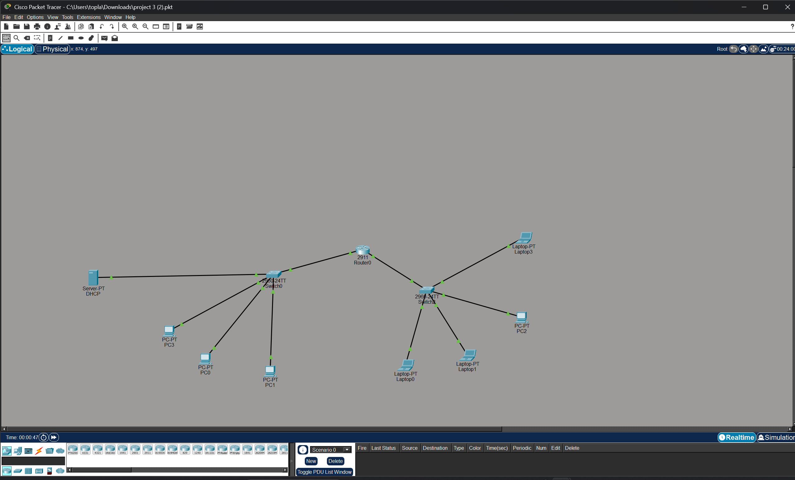

# Basic-DHCP-Router-Lab
Multi-subnet network design in Cisco Packet Tracer featuring inter-LAN routing and dedicated DHCP server configuration
# Simple LAN Interconnection with DHCP Server
# DHCP & Router Configuration Lab

## 🌐 Topology View

## 🛠 Project Description
In this Cisco Packet Tracer lab, I configured a network with a dedicated DHCP Server to provide dynamic IP addresses to multiple workstations.

### Key Features:
* **DHCP Server:** Configured to automate IP assignment for PC0, PC1, and PC3.
* **Router Configuration:** Connecting two different switch segments.
* **Network Segmentation:** Organized workstations into two logical groups through separate switches.

This project demonstrates a basic network infrastructure designed in Cisco Packet Tracer. It features a central router connecting two distinct local area networks (LANs) using a star topology.

### Key Features:
* **Centralized Routing:** Uses a Cisco 2911 Router to manage traffic between subnets.
* **Dynamic Addressing:** Includes a dedicated DHCP server to automate IP assignment for end devices (PCs and Laptops).
* **Scalability:** Two 2960-24TT switches providing connectivity for multiple end-user devices.

### Topology Overview:
* **Subnet A:** Includes a DHCP Server and 3 workstation PCs.
* **Subnet B:** Consists of 3 Laptops and 1 PC, representing a different department or office branch.
